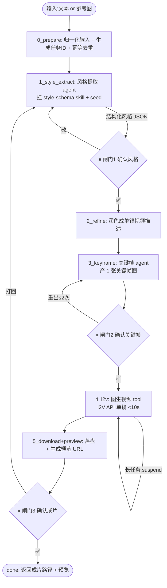

# 文生广告视频自动生成 · 需求确认与开发流程

> 一句话摘要：把 14 号技术调研落成**可开工的独立本地 Web 工具**需求。输入「一段视频描述 或 一张参考图」→ 提取/定义风格 → 生成分镜 → 逐镜先出关键帧再图生视频 → 拼接成片。Mastra 编排 + Agent Skills，前端为**时间轴审阅工作台**（非文档/画布隐喻），MVP 里程碑 M1 以「**实际成片 <10s = 单镜头**」为简化杠杆先跑通全链路。边界：独立本地 Web，不含 IM 入口、git/PR、多人鉴权。

## 〇、本文定位与独立性

- **14 号** = 技术调研：模型能力边界、分镜 skill、awesome-gpt-image-2 复用、Mastra 落地架构（答案齐全但无边界、无验收）。
- **本文（15 号）** = 开发流程 + 需求确认：从 14 号抽出「产品必须怎样 + 用什么框架 + 页面长什么样 + workflow 含哪些 step + 里程碑怎么切」，作为**开工依据与验收判据**。
- **独立性声明**：独立本地 Web 工具。**不含** IM 入口（[[11-IM驱动的多Agent自动开发工作流设计]]）、**不含** git/PR/CI、**不含**多人鉴权。与 11/13 号架构可互借鉴，交付各自独立。
- 与姊妹的差异：13 号产物 = **UI 页面**（静态/文档隐喻）；本文产物 = **视频**（含时间维度）→ 前端是**时间轴工作台**，不是文档阅读器。

---

## 一、关键决策（本轮定案，先钉死）

### 决策 1：awesome-gpt-image-2 → 砍「外部资产依赖」，内化「风格 schema 语料」

> 触发：用户澄清「我只想借鉴它的风格思路，不是被 22 个模板绑死」+「需求本就含『从用户图提取风格』，用户风格大概率对不上预设」→ 判定：预设库运行时查询 = 削足适履。

| 层 | 是什么 | 处置 |
|---|---|---|
| A. 数据资产（22 模板 / `styles[]`） | 运行时查 `style-library.json` 选风格 | **砍掉**——不做运行时依赖 |
| B. 风格 schema 思维 | 把「风格」拆成可操作维度结构化描述 | **内化**成项目内风格提取 SKILL 语料 |

- 内化内容：`style / color / lighting / composition / materials` + 视频补 `motion / camera / duration`（14 §3.3 映射表骨架）。
- 风格**主来源 = 用户输入**：参考图 → LLM 按维度提取；文本描述 → LLM 按维度结构化定义。两者都绕开预设库。
- **无参考输入的兜底**：保一个**极小自建风格 seed**（3–5 个常用广告风格：科技感 / 温情 / 大片感 / 萌系 / 极简），防「纯文本自由发挥 → 风格漂移」（10 号反复警告的老问题）。seed 从 awesome 思路抽几类写死进语料，**不引仓库**。

### 决策 2：MVP 用「<10s = 单镜头」做简化杠杆

> 触发：用户问「首个可用里程碑要求实际时长 <10s，可否简化」。**可以，且这是全案最关键的简化。**

一手依据（14 §1.1）：多数模型**单次 I2V 就能到 8–30s**——Kling I2V 3–15s/参考模式 30s、Veo3.1 I2V 8s、Luma Extend≈30s、Sora2 20s。

**<10s 隐含 = 单镜头单次生成**，从而**绕开整条最复杂的「多分镜拼接」模块**：
- 不需要多分镜拆解/串联
- 不需要首尾帧 chain（尾帧作下镜首帧）
- 不需要跨镜一致性管理 / 角色 verbatim 锁定
- 不需要转场 / 时间轴拼接 ffmpeg
- 不需要分镜 skill（ai-cinematic / aivp-storyboard）——只产 1 个关键帧 + 1 次 I2V

**留下的完整链路仍是「关键帧图 → 图生视频」**：先 1 张关键帧 → 1 次 I2V → 预览。这验证了 14 号核心结论「先生图再生视频」在最小切片上依然成立，只是从「N 关键帧 + 拼接」降为「1 关键帧 + 1 次生成」。

> 取舍收益：把「风格提取 + 关键帧 + I2V + 预览」这条核心闭环**先跑通验证价值**；多镜拼接/一致性作为后续里程碑加回，不动已跑通的核心。

---

## 二、目标与非目标

### 2.1 产品一句话

> 在本地 Web 页输入「一段视频广告描述」或「一张参考图」→ 系统提取/定义风格 → 自动出关键帧 → 图生视频 → 时间轴预览 → 用户确认。给非技术/运营做 30s–3min 广告片自动生成，先以 <10s 单镜头跑通。

### 2.2 MVP 范围表（砍刀线）

| 范围 | 条目 | 说明 |
|---|---|---|
| ✅ **In** | 本地 Web 收「文本描述 或 参考图」 | 双输入路径，独立界面 |
| ✅ In | 风格提取/定义（LLM 结构化） | 图→按维度提取；文本→按维度定义 |
| ✅ In | 风格 schema 语料 skill（内化 awesome 思路 + 极小 seed） | 项目内语料，非外部仓库 |
| ✅ In | 关键帧图生成（图像模型） | 复用风格语料产 1 帧 |
| ✅ In | 图生视频（I2V，单镜） | 视频 API / HTTP tool |
| ✅ In | 视频预览 + 人工确认闸门 | 前端时间轴工作台展示 |
| ✅ In | **M1 实际成片 <10s（单镜头）** | 全链路简化杠杆，先跑通 |
| ❌ **Out（首版不做）** | 多分镜拆解 / 多镜拼接 / ffmpeg 合成 | 10s 以下单镜不需要 |
| ❌ Out | 首尾帧 chain / 跨镜角色一致性 / 转场 | 单镜无关 |
| ❌ Out | 多风格并行挑选 | 单风格跑通后 P1 加 |
| ❌ Out | git commit / PR / 合并 | 交付止于本地可跑 + 预览 |
| ❌ Out | 飞书/微信 IM 入口 | 本地 Web 自带 |
| ❌ Out | 多人鉴权 / CI | 不落 git，多人化不适用 |
| 🔜 **Later** | 多分镜 + 首尾帧拼接成 30s+、多风格挑选、音频/口播/字幕、git 落地 | §十里程碑 |

---

## 三、端到端用户旅程（在哪些点被卡、看到什么）

两条输入路径，汇入同一个 workflow；用户在 **3 个人工闸门**被卡，其余全自动：

```
[路径A·文本] 用户输入："做一个 30 秒的科技感咖啡机广告"
[路径B·图]   用户上传一张咖啡机产品图
   ↓ 自动：风格提取 agent（图→按维度提取 / 文本→按维度定义 + seed 兜底）
①【闸门1·确认风格】时间轴工作台展示风格卡：色板/光感/构图/运动语言/参考缩略，用户【✅用这个 / 换一套 / 改】
   ↓ 自动：润色描述 → 关键帧 agent 产 1 张关键帧图
②【闸门2·确认关键帧】展示关键帧大图，用户【✅用这帧 / 重出关键帧(≤2次)】
   ↓ 自动：I2V 视频生成（单镜）→ 下载落盘
③【闸门3·确认成片】播放器预览 <10s 成片，用户【✅完成 / 打回(回闸门1或2)】
   ↓
[用户] 拿到成片文件路径 + 预览；本地交付完成（无 git/PR）
```

**每个闸门一次点选**（确认/换/改），不强制用户填表单写参数——这是本条链路 UX 核心（同 13 号纪律）。

---

## 四、技术选型（框架落定）

| 部分 | 选型 | 理由 |
|---|---|---|
| 编排引擎 | **Mastra**（TS-native workflow + agent + skills + suspend/resume） | 14/10/13 号已锁定；确定性 step + 长任务挂起 |
| 后端宿主 | **Node.js + TypeScript**（Mastra 服务 + HTTP API，Koa/Fastify 壳） | 纯 TS 栈，本地起服务 |
| 前端框架 | **React + Next.js + Tailwind** | 延续 10/13 号；时间轴组件生态、本地 dev 预览顺 |
| 状态/持久化 | **Postgres**（workflow 快照 + 任务 + 审核记录）+ 本地任务文件目录 | 长任务 suspend 跨重启；任务去重 |
| 视频引擎 | 首版倾向 **Kling 2.1**（I2V 3–15s 够 <10s；后续 1080p+chain）；画质优先切 Veo3.1 | 14 §5.3 |
| 关键帧图像 | 图像模型 API（GPT-Image2 / FLUX），风格挂本项目语料 | 产首帧，吃风格 schema |
| 视频/图像调用 | **自建 HTTP tool**（`createTool` + fetch 直连 API）或 **MCP**（如 Composio Veo MCP） | 14 §4.2：视频无官方原生集成 |
| 风格语料 | 项目内 `skills/` 目录 + seed JSON | 决策 1：不依赖外部仓库 |

---

## 五、前端页面设计与风格

> 本工具的产物是**视频（时间序列）**，所以 UI 的隐喻是 **「时间轴工作台」**（参照剪映 / Pr / DaVinci 的媒体工作台布局），**不是** 13 号那种文档阅读器，也**不需要** 12 号那种「2D 无限画布」——产物是线性时间流，画布自由摆放毫无增益，反而引入平移/缩放复杂度。

### 5.1 不需要「无限画布」（直接回答）

- 本工具的信息结构 = 一条**线性时间轴 + 每个节点的竖向卡片堆栈**，不是「在 2D 空间自由摆多个元素」。
- 真正需要画布的领域（Figma/Claude Design/Stitch）解决的是「多图层/多元素空间编排」，视频审阅不涉及。
- **结论：不用无限画布。** 用固定布局的时间轴 + 预览区即可，后续多分镜也只是把 1 镜横向扩展成 N 镜卡片，仍是「轴」，不是「面」。
- 若未来要「关键帧精细编辑/多镜对齐」，届时评估局部画布组件，非全屏无限画布。

### 5.2 整体版式（媒体工作台风）

**明暗主题：深色**（媒体/剪辑工具惯例，暗背景利于视频/图预览突出、长时间审片护眼）。主框架三段式：

```
┌─────────────────────────────────────────────┐
│ 顶栏：Logo · 任务名 · 阶段进度条(S0→S5) · 运行状态  │
├───────────────────────┬─────────────────────┤
│                       │  右栏（当前闸门面板）    │
│    主预览区            │  - 风格卡 / 参数 /    │
│   - 风格阶段:关键帧大图 │    确认按钮区          │
│   - 成片阶段:<video>播放│  - workflow 日志(折叠) │
│                       │                     │
├───────────────────────┴─────────────────────┤
│ 底部时间轴条（M1 单镜=1 节点；Later 多镜=横向节点链）│
│   [①风格]→[②关键帧]→[③视频]                  │
└─────────────────────────────────────────────┘
```

### 5.3 各区域要点

| 区域 | 内容 | 交互 |
|---|---|---|
| 顶栏进度 | 当前 workflow 阶段 + 状态（运行/挂起/失败） | 静态指示 |
| 主预览区 | 关键帧图 or `<video>` 播放器（M1）；Later 主轨多分镜 | 播放/暂停/逐帧 |
| 右栏·闸门 | 当前要人拍板的卡片 + 一次点选按钮 | ✅/换/改/重出/打回 |
| 底部时间轴 | M1=单节点卡（风格/关键帧/成片三个状态点）；Later=N 分镜横卡 | 点选定位 |
| 输入区（起始） | 两条输入卡片：文本框 or 图上拖 | 上传/提交 |

### 5.4 页面风格基调

- **配色**：深灰蓝底（如 `#111318`）+ 主色青/紫点缀 + 白字；不是营销页、是工具面板，低饱和、信息密度高。
- **质感**：扁平 + 细边框 + 轻微圆角；无重型玻璃拟态/渐变营销感。
- **组件**：Tailwind + 少量现成组件（播放器自封装，不引重型视频编辑库）；时间轴 M1 用纯 React 自绘卡片即可。
- **字体**：数字/时码用等宽，正文系统字体。
- 风格一致性本可用 DESIGN.md token 约束（同 13），但**本工具非 UI 产品交付**，首版不强求 DESIGN.md lint，用一份手写 `style-tokens.ts` 常量即可（能演进再迁）。

---

## 六、Mastra Workflow 完整步骤

> 双输入路径（文本/图）在 `①风格提取` 汇合。确定性 step 硬控流程；skill 教 agent「按维度提取风格/产关键帧」；人工闸门用 suspend。



### 6.1 每个 step 的输入/输出/落点

| Step | 类型 | 输入 | 输出 | 关键机制 |
|---|---|---|---|---|
| S0 prepare | 确定性 | 原始输入 | 归一化文本/图 + taskId | 幂等去重（同输入只跑一个 run） |
| S1 style_extract | Agent | 文本 或 图 | **结构化风格 JSON**（style/color/lighting/composition/materials/motion/camera/duration） | 挂 `style-schema` skill；图路径 LLM 视觉提取，文本路径 LLM 定义 + seed 兜底；schema 校验不过打回 |
| 闸门1 | suspend | 风格 JSON | 用户确认/换/改 | 挂起等用户 |
| S2 refine | Agent | 风格 + 原始输入 | 单镜视频描述（<10s 一个动作） | 基于确认风格润色 |
| S3 keyframe | Agent/工具 | 单镜描述 + 风格 | 关键帧图 URL + 落盘 | 图像模型 + 风格语料 |
| 闸门2 | suspend | 关键帧图 | 确认/重出（≤2 次） | 防乱花图像 credits |
| S4 i2v | Tool | 关键帧图 + 描述 | 视频 jobId/URL | I2V API；长任务 step 内轮询或 suspend/resume |
| S5 finalize | 确定性 | 视频 URL | 成片文件 + 预览 URL | ffmpeg 可选放大/裁切（<10s 单镜一般无需拼接） |
| 闸门3 | suspend | 成片 | 确认/打回 | 打回回 S1 |

### 6.2 长任务处理（视频生成几十秒~分钟）

- 机制1：step 内轮询（I2V API job 状态直到 done，abortSignal 响应取消）——适合 <30s。
- 机制2：`suspend` + 外部恢复（提交 jobId 后挂起，webhook/worker 视频产出后 resume）——适合分钟级 + 跨重启。
- 来源：14 §4.3（Mastra suspend/resume + background tasks）。**M1 用机制 1**（<10s 单镜几十秒内完成，轮询即可，省掉复杂恢复）。

### 6.3 Skills 清单（挂进 workspace skills）

| Skill | 何时加载 | 强制 | 输入 | 输出 |
|---|---|---|---|---|
| `style-schema`（内化 awesome 思路） | S1 | ✅ | 风格提取维度说明 + seed | 结构化风格字段规范，agent 按此产出 |
| `keyframe-prompt`（视频分镜出帧） | S3 | ✅ | 单镜描述 + 风格 | 关键帧 prompt（含单动作/运动语言） |
| （Later）`storyboard` / `shot-seq` | M3+ | ✅ | 脚本 | N 分镜 JSON |

- 装配：Mastra workspace skills 目录，agent 自动获 `skill/skill_read/skill_search`（14 §4.4）。
- **落地纪律（同 13）**：S1/S3 这些「必须用 skill 的维度」靠 workflow 里 `agent.getSkill()` 显式取指令拼进 prompt，不靠模型自选（14 §5.2/11 §11.4 分层）。

---

## 七、可验收需求清单

> 用户/产品语言，每条带判据。

**R1 输入**：R1.1 本地 Web 收文本或上传图；R1.2 同输入幂等去重。
**R2 风格**：R2.1 图路径 LLM 按维度提取结构化风格（非自由文本）；R2.2 文本路径按维度定义，无参考时落 seed 兜底；R2.3 风格产物过 schema 校验，不过打回 S1；R2.4 闸门1 用户确认风格后才进 S2。
**R3 关键帧**：R3.1 产 1 张关键帧图，风格与闸门1 确认一致；R3.2 闸门2 确认/重出 ≤2 次。
**R4 成片**：R4.1 M1 实际成片 **<10s**（单镜）；R4.2 先生关键帧再图生视频（非文本一步到 10s）；R4.3 闸门3 预览可播放。
**R5 闸门/护栏**：R5.1 每自动环节重试 ≤2 次超限告警；R5.2 闸门 suspend 期间不烧预算、超时提示；R5.3 打回回 S1 重来（不从头）。
**R6 交付**：R6.1 交付= 成片文件 + 预览 URL + 关键帧 + 风格 JSON；R6.2 无任何 git 写操作。

---

## 八、失败恢复与幂等

| 失败场景 | 处理 |
|---|---|
| workflow 进程崩溃 | 状态落 Postgres + checkpoint，重启从崩溃 stage 恢复 |
| I2V/图像 API 超时 | abortSignal 中断、清理半成品、记失败重试 ≤R5.1 |
| 视频 API 配额/报错 | 区分「环境/配额」vs「真实缺陷」，配额不耗重试额度，提示充值 |
| 用户图解析失败/非图片 | 提示改传；支持常见格式转正 |
| 闸门挂起后改主意 | 提供回上一闸门入口 |
| 同需求重复触发 | 幂等去重，同 taskId 只跑一个 |
| 多需求并发 | 每需求独立 run + 独立目录/DB 记录 |

---

## 九、技术风险与缓解

| 风险 | 现状 | 缓解 |
|---|---|---|
| 视频 API 无官方原生集成（Mastra） | 需自建 HTTP tool/MCP | 封装独立 provider 模块，API 变动只动该层 |
| Sora2 API 2026-09-24 停用 | 生产不能依赖 | 主引擎 Kling 2.1；不押 Sora2 |
| I2V 首帧风格一致性 | 图像→视频可能漂移 | 风格 JSON 作为 I2V prompt 前缀 verbatim 传入 |
| 关键帧图与成片差异 | 图生视频不一定忠于帧 | 以「首帧引用 + 描述锁定」双约束，闸门2 人工把关 |
| awesome 砍掉后 seed 太少 | 纯文本自由发挥漂移 | seed 扩到 5 类常用广告风格，够首版锚定 |
| Mastra skill 装配 API 迭代 | Workspace/skills 可能微调 | 集中在独立模块，升级只动装配层 |
| 视频生成贵/慢 | 长耗时 + credits | M1 单镜 <10s 控制成本；闸门2/3 人工把关防乱烧 |

---

## 十、MVP 里程碑

> 纪律：每个里程碑跑通即有「当时算完」的验收记录再进下一个。**M1 就靠「<10s 单镜」砍掉分镜/拼接/一致性，先验证「风格提取→关键帧→I2V→预览」核心价值。**

| 里程碑 | 交付 | 成片时长 | 对应需求 | 前端新增 |
|---|---|---|---|---|
| **M1 最小单镜切片** | 文本/图 → 风格(seed/提取) → 1 关键帧 → 1 次 I2V → 本地预览 <10s | **<10s 单镜** | R1,R2,R3,R4,R6 | 输入页 + 单节点时间轴 + 3 闸门面板 + 播放器 |
| **M2 工程强化** | 幂等/失败恢复/长任务 suspend/Postgres checkpoint/重试护栏全量 | <10s 单镜 | R5, §八全 | 任务列表/日志/重试 UI |
| **M3 多分镜+拼接** | 拆 N 分镜 → 逐镜关键帧 → 逐镜 I2V → ffmpeg 拼接 | 10s–3min | §八 Later | 时间轴 N 分镜横卡 + 首尾帧 chain 显示 + 拼接触发 |
| **M4 一致性强化** | 跨镜角色/产品/Logo verbatim 锁定 + 首尾帧双图驱动 | 10s–3min | — | 分镜参数锁定 + 一致性 QA 提示 |
| **M5 多风格挑选（P1）** | 风格层并行 2–3 套候选 → 挑一固化；多图/音频/口播/字幕 | 10s–3min | — | 风格对比选择 + 音频轨 |

> 落地注记：M3 是真正把「广告视频」价值做满的里程碑（M1/M2 只是验证单镜引擎可靠）；M1 若发现单镜价值不足、成片太短不像广告，应及时在 M3 前重新评估——不要在错误假设上堆 M2。
> （git 落地、IM 入口、多人化不属于本需求 MVP，后续按独立扩展评估。）

---

## 十一、待细化（下一步开工点）

- M1 的 Mastra workflow step 可运行 TS 骨架（S0→闸门1→S3→闸门2→S4→S5→闸门3）
- `style-schema` skill 的 SKILL.md + seed JSON（内化 awesome 维度 + 5 类广告 seed）
- Kling 2.1 I2V 的 HTTP tool（job 提交/轮询/下载）
- 前端 M1 页面骨架（Next.js + Tailwind 时间轴工作台，深色）

## 关联

- [[14-文生广告视频自动生成-技术调研]] — 本文技术依据（怎么做）
- [[13-需求到成品AI链路-需求确认文档]] — 姊妹需求（UI 产品链路）与模板
- [[12-需求到成品AI链路与DESIGN.md多风格调研]] — 图像链路调研（可借鉴风格/闸门思路）
- [[11-IM驱动的多Agent自动开发工作流设计]] — 另一独立需求（工程外壳），非组合件
- [[10-实习生产品开发工具设计文档]] — 产品迭代内核（关卡交互/风格锁定可借鉴）
